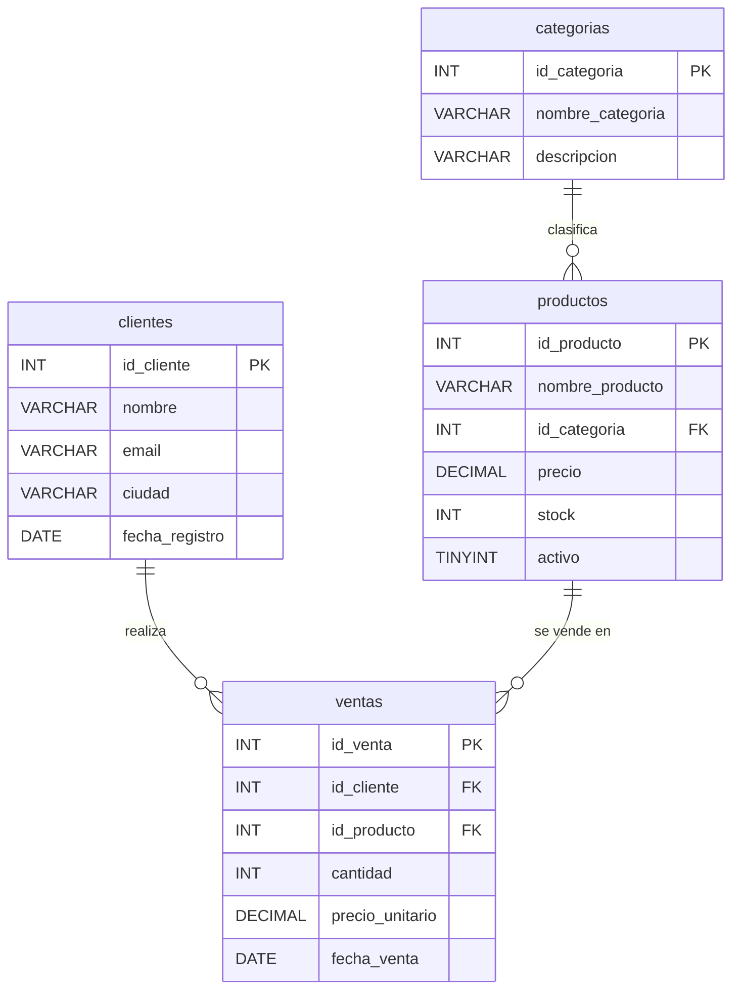

# 🛒 RetailPro — Análisis de Ventas de Retail Tecnológico

Proyecto de Data Analytics que recorre el ciclo completo de trabajo con datos de un negocio de venta de tecnología: **diseño de base de datos**, **manipulación y consulta con SQL**, **pipeline ETL con Power Query (Lenguaje M)** y **visualización en Power BI**.

El objetivo es mostrar, de forma ordenada y reproducible, cómo se pasa de un modelo de datos relacional a respuestas concretas para el negocio: cuánto se factura, qué productos y clientes concentran las ventas y cómo evoluciona el desempeño mes a mes.

> 📝 **Versión 2 del README.** Las partes modificadas respecto de la versión 1 están señaladas con la etiqueta 🔄 **Cambio N** y su justificación. Al final hay un [registro de cambios](#-registro-de-cambios-v1--v2) con el resumen.

---

## 📑 Tabla de contenidos

1. [Inicio rápido](#-inicio-rápido) 🔄
2. [Descripción del proyecto](#-descripción-del-proyecto)
3. [Estructura del repositorio](#-estructura-del-repositorio)
4. [Modelo de datos](#-modelo-de-datos)
5. [Herramientas utilizadas](#-herramientas-utilizadas)
6. [Cómo ejecutar los scripts SQL](#-cómo-ejecutar-los-scripts-sql) 🔄
7. [Solución de problemas](#-solución-de-problemas) 🔄
8. [Consultas de negocio y hallazgos](#-consultas-de-negocio-y-hallazgos)
9. [Archivos de Power BI y ETL](#-archivos-de-power-bi-y-etl)
10. [Limitaciones y posibles mejoras](#-limitaciones-y-posibles-mejoras) 🔄
11. [Registro de cambios (v1 → v2)](#-registro-de-cambios-v1--v2)
12. [Autor](#-autor)

---

## ⚡ Inicio rápido

> 🔄 **Cambio 1 — Sección nueva "Inicio rápido".**
> **Justificación:** en la versión 1 había que leer todo el documento para saber por dónde empezar. Un resumen de tres pasos al comienzo permite que cualquier persona que llegue al repositorio pueda reproducir el proyecto en pocos minutos, y deja el detalle para quien lo necesite.

1. Abrir **SQL Server Management Studio** y conectarse a la instancia.
2. Ejecutar `m3_Ventas_Tech_DB.sql` para crear la base `Ventas_Tech_DB` con sus tablas y datos.
3. Ejecutar `m4_consultas_negocio.sql` y `m5_consultas_joins.sql` para ver las consultas de negocio.

---

## 📌 Descripción del proyecto

**RetailPro** simula la operación comercial de una tienda de tecnología (laptops, monitores, accesorios, audio y almacenamiento). El proyecto se construyó de manera incremental, por módulos:

| Etapa | Qué se hace |
|---|---|
| **Diseño** | Definición de tablas, tipos de datos y claves. |
| **Construcción de la base** | Creación de la base `Ventas_Tech_DB` con sus relaciones y carga de datos de ejemplo. |
| **Consultas de negocio** | Agregaciones, rankings, filtros con `HAVING`, CTEs y clasificación con `CASE`. |
| **Consultas con JOINs** | Vista consolidada, detección de clientes/productos sin ventas y `UNION ALL`. |
| **Manipulación de datos** | Uso de `INSERT`, `UPDATE` y `IDENTITY` sobre una tabla de inventario. |
| **ETL y visualización** | Pipeline de limpieza y transformación con Lenguaje M y reportes en Power BI. |

---

## 📂 Estructura del repositorio

```
Proyecto-RetailPro/
├── modulo2_unidad1_diseno.sql                 # Diseño de tablas y tipos de datos
├── m3_Ventas_Tech_DB.sql                      # Creación de la base, tablas, relaciones y datos
├── m4_consultas_negocio.sql                   # Consultas analíticas de negocio
├── m5_consultas_joins.sql                     # Consultas con JOIN y UNION ALL
├── manipulacion_de_datos.sql                  # DDL + DML sobre la tabla de inventario
├── Pipeline_ETL_Mavric_Gonzalo.pbix           # Pipeline ETL en Power BI
├── Mavric_Gonzalo_Checkpoint2_V2.pbix         # Checkpoint 2 del proyecto en Power BI
└── Lenguaje_M_Pipeline_ETL_Mavric_Gonzalo.pdf # Documentación del pipeline ETL (Lenguaje M)
```

### Detalle de los scripts SQL

| Script | Contenido |
|---|---|
| `modulo2_unidad1_diseno.sql` | Ejercicio de diseño: tablas `clientes` y `productos` con tipos de datos justificados (`INT`, `VARCHAR`, `TEXT`, `DATE`, `DECIMAL`, `SMALLINT`). |
| `m3_Ventas_Tech_DB.sql` | Crea la base `Ventas_Tech_DB` y las tablas `categorias`, `clientes`, `productos` y `ventas`, con claves primarias y foráneas. Inserta datos de ejemplo. |
| `m4_consultas_negocio.sql` | Facturación mensual, Top 5 de productos, clientes recurrentes y comparación de cada mes contra el promedio. Incluye conclusiones al final del archivo. |
| `m5_consultas_joins.sql` | Reconstruye la base y resuelve cuatro consultas: vista base (`INNER JOIN`), clientes sin ventas y productos sin ventas (`LEFT JOIN … IS NULL`) y consolidado por quincena (`UNION ALL`). |
| `manipulacion_de_datos.sql` | Script de inventario ("BodegaTech"): crea la tabla `inventario` con `IDENTITY`, inserta 10 productos y realiza actualizaciones de stock y estado. |

---

## 🗄️ Modelo de datos

Base de datos: **`Ventas_Tech_DB`**



**Métrica principal:** el total de cada venta se calcula como `cantidad * precio_unitario`.

---

## 🧰 Herramientas utilizadas

| Herramienta | Uso en el proyecto |
|---|---|
| **SQL Server (T-SQL)** | Motor de base de datos donde se ejecutan los scripts. |
| **SQL Server Management Studio (SSMS)** | Entorno para escribir y ejecutar las consultas. |
| **Power BI Desktop** | Modelado y visualización de datos. |
| **Power Query / Lenguaje M** | Extracción, limpieza y transformación de datos (ETL). |
| **Git y GitHub** | Control de versiones y publicación del proyecto. |

> **Nota:** los scripts usan sintaxis propia de SQL Server (por ejemplo `TOP (5)` e `IDENTITY(1,1)`), por lo que se recomienda ejecutarlos en ese motor.

---

## ▶️ Cómo ejecutar los scripts SQL

### Requisitos previos

- SQL Server 2016 o superior (por el uso de `DROP TABLE IF EXISTS`). Sirve la edición **Express** o **Developer**, ambas gratuitas.
- SQL Server Management Studio (SSMS) u otro cliente compatible con T-SQL, como Azure Data Studio.

### Paso a paso

1. **Clonar el repositorio**
   ```bash
   git clone https://github.com/Gonzalomavric92/Proyecto-RetailPro.git
   cd Proyecto-RetailPro
   ```
2. **Conectarse** a la instancia de SQL Server desde SSMS.
3. **Abrir un script** con `Archivo > Abrir > Archivo…` y seleccionarlo.
4. **Ejecutar** el script completo con `F5` (o el botón *Execute*).
5. **Verificar** los resultados en la pestaña *Results* y los mensajes en *Messages*.

### Orden recomendado

| Orden | Script | Observaciones |
|:-:|---|---|
| 1 | `m3_Ventas_Tech_DB.sql` | **Base del proyecto.** Crea la base de datos, las tablas y los datos. Ejecutar primero. |
| 2 | `m4_consultas_negocio.sql` | Requiere que las tablas `clientes` y `productos` ya existan (creadas en el paso 1). |
| 3 | `m5_consultas_joins.sql` | Es autosuficiente: elimina y vuelve a crear las tablas antes de consultar. |
| — | `modulo2_unidad1_diseno.sql` | Ejercicio independiente. Ejecutar en una **base de prueba**, no en `master` ni en `Ventas_Tech_DB`. |
| — | `manipulacion_de_datos.sql` | Ejercicio independiente sobre la tabla `inventario`. Ejecutar en una base de prueba. |

### Verificar que la carga fue correcta

> 🔄 **Cambio 2 — Se agrega un paso de verificación posterior a `m3_Ventas_Tech_DB.sql`.**
> **Justificación:** la versión 1 explicaba cómo ejecutar los scripts, pero no cómo comprobar que habían funcionado. Con estas consultas cualquier persona puede confirmar que la base quedó cargada como se espera antes de pasar a las consultas de negocio, lo que hace al proyecto realmente reproducible.

Luego de ejecutar `m3_Ventas_Tech_DB.sql`, correr:

```sql
USE Ventas_Tech_DB;

-- Cantidad de filas por tabla
SELECT 'categorias' AS tabla, COUNT(*) AS filas FROM categorias
UNION ALL SELECT 'clientes',  COUNT(*) FROM clientes
UNION ALL SELECT 'productos', COUNT(*) FROM productos
UNION ALL SELECT 'ventas',    COUNT(*) FROM ventas;

-- Facturación total
SELECT SUM(cantidad * precio_unitario) AS total_facturado FROM ventas;
```

**Resultado esperado:**

| Tabla | Filas |
|---|:-:|
| `categorias` | 4 |
| `clientes` | 5 |
| `productos` | 6 |
| `ventas` | 10 |

Y una facturación total de **6444.00**.

> Si después se ejecuta `m5_consultas_joins.sql`, `clientes` pasará a tener 6 filas y `productos` 7, porque ese script agrega un cliente y un producto sin ventas para ilustrar los `LEFT JOIN`.

### Consideraciones

- **Si la base ya existe:** los scripts `m3`, `m4` y `m5` comienzan con `CREATE DATABASE Ventas_Tech_DB;`. Si ya la creaste antes, esa línea devolverá un error; basta con omitirla (o comentarla) y continuar con `USE Ventas_Tech_DB;`.
- **Volver a empezar:** `m3` y `m5` eliminan las tablas (`DROP TABLE IF EXISTS`) antes de recrearlas, por lo que pueden ejecutarse varias veces para restablecer los datos.
- **Scripts independientes:** `modulo2_unidad1_diseno.sql` y `manipulacion_de_datos.sql` no seleccionan ninguna base de datos. Antes de ejecutarlos, elegí una base de prueba con `USE nombre_base;`.

---

## 🛠️ Solución de problemas

> 🔄 **Cambio 3 — Sección nueva "Solución de problemas".**
> **Justificación:** al revisar los scripts se identificaron situaciones previsibles que generan errores (base ya creada, dependencias entre tablas, sintaxis exclusiva de SQL Server). En la versión 1 estaban dispersas en notas sueltas; reunirlas en una tabla permite resolver los problemas más rápido y reduce las consultas al autor.

| Síntoma | Causa probable | Solución |
|---|---|---|
| `Database 'Ventas_Tech_DB' already exists` | La base ya fue creada en una ejecución anterior. | Omitir o comentar la línea `CREATE DATABASE` y seguir con `USE Ventas_Tech_DB;`. |
| Error de clave foránea al ejecutar `m4_consultas_negocio.sql` (`ventas` referencia tablas inexistentes) | Se ejecutó `m4` sin haber creado antes `clientes` y `productos`. | Ejecutar primero `m3_Ventas_Tech_DB.sql`. |
| `Incorrect syntax near 'TOP'` o `IDENTITY` | Se está usando un motor distinto de SQL Server (por ejemplo MySQL). | Ejecutar los scripts en SQL Server o adaptar la sintaxis (`LIMIT` en lugar de `TOP`). |
| Las tablas aparecen en la base `master` | Se ejecutó un script sin `USE`, por ejemplo `modulo2_unidad1_diseno.sql`. | Seleccionar una base de prueba con `USE nombre_base;` antes de ejecutar. |
| `Violation of PRIMARY KEY constraint` | Se volvieron a insertar los datos sin recrear las tablas. | Ejecutar nuevamente el script completo; `m3` y `m5` eliminan las tablas antes de crearlas. |

---

## 📊 Consultas de negocio y hallazgos

El archivo `m4_consultas_negocio.sql` responde preguntas clave sobre los datos de ventas:

- **Facturación mensual:** total facturado, cantidad de pedidos y ticket promedio.
- **Top 5 de productos:** ranking por facturación y unidades vendidas.
- **Clientes recurrentes:** clientes con más de un pedido y su gasto total.
- **Desempeño mensual:** cada mes clasificado como *Por encima*, *Por debajo* o *Igual al promedio*.

### Principales conclusiones

Con los 10 registros de ventas de ejemplo (facturación total de **$6.444**):

1. **Producto 1 (Laptop Pro 15):** concentra el **55,9 %** de la facturación (**$3.600**) con solo 3 unidades vendidas. Pesa por valor, no por volumen.
2. **Cliente 1:** es el de mayor gasto (**$2.640** en 2 pedidos), por encima del cliente 5 (**$2.100**).
3. **Producto 2 (Mouse Inalámbrico):** representa el **44,8 %** de las unidades vendidas (13 de 29) pero solo el **5,6 %** de la facturación (**$364**). Es el caso opuesto al producto 1: mucho volumen y poco valor unitario.

> Al ser un conjunto de datos reducido, estos resultados tienen fines ilustrativos del método de análisis.

---

## 📈 Archivos de Power BI y ETL

| Archivo | Descripción |
|---|---|
| `Pipeline_ETL_Mavric_Gonzalo.pbix` | Pipeline ETL construido con Power Query. |
| `Mavric_Gonzalo_Checkpoint2_V2.pbix` | Segundo checkpoint del proyecto en Power BI. |
| `Lenguaje_M_Pipeline_ETL_Mavric_Gonzalo.pdf` | Documento con el detalle del pipeline y el código en Lenguaje M. |

Para abrir los archivos `.pbix` se necesita [Power BI Desktop](https://powerbi.microsoft.com/desktop/) (gratuito, solo Windows).

---

## 🚧 Limitaciones y posibles mejoras

> 🔄 **Cambio 4 — Sección nueva "Limitaciones y posibles mejoras".**
> **Justificación:** un README completo también debe dejar claro el alcance real del proyecto. Explicitar las limitaciones evita interpretar de más los resultados (por ejemplo, las conclusiones de ventas salen de solo 10 registros) y muestra criterio analítico, además de orientar la evolución futura del repositorio.

**Limitaciones**

- El conjunto de datos de `Ventas_Tech_DB` es pequeño (10 ventas, 5 clientes, 6 productos), por lo que los hallazgos son ilustrativos y no estadísticamente representativos.
- Las ventas cubren solo marzo de 2024; el análisis mensual no permite comparar períodos.
- El código de creación de tablas y carga de datos se repite en `m3`, `m4` y `m5`.
- Los scripts solo se probaron en SQL Server.

**Posibles mejoras**

- Separar la creación de la base y la carga de datos en un script de *setup* único, y dejar `m4` y `m5` solo con consultas.
- Hacer el `CREATE DATABASE` re-ejecutable con `IF DB_ID('Ventas_Tech_DB') IS NULL`.
- Ampliar los datos de ejemplo para abarcar más meses y habilitar análisis de evolución y estacionalidad.
- Conectar la base `Ventas_Tech_DB` con Power BI para que los reportes se alimenten directamente de las consultas SQL.

---

## 🔄 Registro de cambios (v1 → v2)

| N.º | Sección modificada | Cambio realizado | Justificación |
|:-:|---|---|---|
| 1 | Inicio rápido (nueva) | Resumen de tres pasos al comienzo del documento. | Permite reproducir el proyecto rápidamente sin leer todo el README. |
| 2 | Cómo ejecutar los scripts SQL | Se agregó un paso de verificación con consultas y resultados esperados. | Permite comprobar que la carga fue correcta y mejora la reproducibilidad. |
| 3 | Solución de problemas (nueva) | Tabla de errores frecuentes, causas y soluciones. | Reúne en un solo lugar los problemas previsibles detectados al revisar los scripts. |
| 4 | Limitaciones y posibles mejoras (nueva) | Alcance real del proyecto y próximos pasos. | Evita sobreinterpretar resultados de un dataset pequeño y orienta la evolución del repositorio. |

---

## 👤 Autor

**Gonzalo Mavric**
📎 GitHub: [@Gonzalomavric92](https://github.com/Gonzalomavric92)

Proyecto desarrollado como parte de un curso de Data Analytics.
